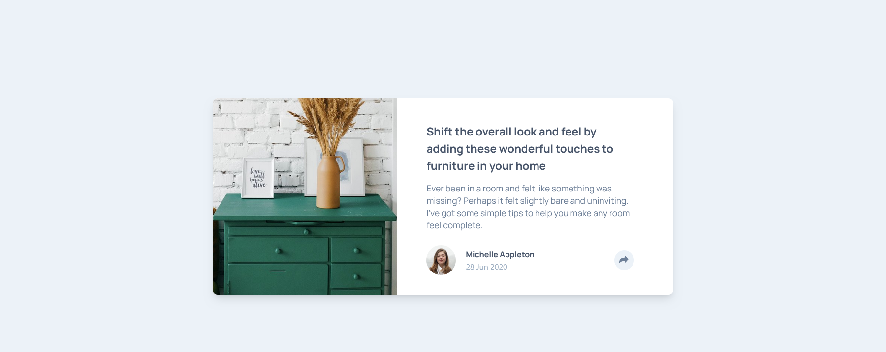
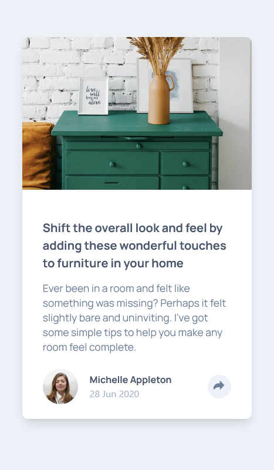

# Frontend Mentor - Article preview component solution

This is a solution to the [Article preview component challenge on Frontend Mentor](https://www.frontendmentor.io/challenges/article-preview-component-dYBN_pYFT). Frontend Mentor challenges help you improve your coding skills by building realistic projects. 

## Table of contents

- [Overview](#overview)
  - [The challenge](#the-challenge)
  - [Screenshot](#screenshot)
  - [Links](#links)
- [My process](#my-process)
  - [Built with](#built-with)
  - [What I learned](#what-i-learned)
  - [Useful resources](#useful-resources)
- [Author](#author)

## Overview

### The challenge

Users should be able to:

- View the optimal layout for the component depending on their device's screen size
- See the social media share links when they click the share icon

### Screenshot

### Links

- Solution URL: [Add solution URL here](https://your-solution-url.com)
- Live Site URL: [Add live site URL here](https://your-live-site-url.com)

### Built with

- Semantic HTML5 markup
- Tailwind CSS 
- Flexbox
- Javascript
- Mobile-first workflow

### What I learned

This project was my first experience working with Tailwind CSS, and I learned a lot throughout the process. Some of the key takeaways include:

    Rapid Prototyping: Tailwind CSS allowed me to quickly prototype and style components without having to write custom CSS from scratch. The utility-first approach made it easy to apply styles directly in the HTML markup, saving time and increasing productivity.

    Responsive Design: Tailwind CSS's responsive design utilities enabled me to create a responsive layout that adapts to different screen sizes seamlessly. By utilizing classes like lg:hidden and lg:block, I was able to hide and show elements based on screen breakpoints, enhancing the user experience across devices.

    Customization: While Tailwind CSS provides a comprehensive set of utility classes out of the box, I also learned how to customize and extend Tailwind's default configuration to suit specific project requirements. Customizing colors, typography, spacing, and other aspects allowed me to tailor the design to match the project's visual style.

Overall, my experience working with Tailwind CSS was positive, and I look forward to using it in future projects to streamline my workflow and create beautiful, responsive designs efficiently.

### Useful resources

- [Tailwind Docs](https://tailwindcss.com/docs/installation) - This helped me to easily find what I wanted. It helped me learn how Tailwind CSS works and know the names of classes and also customize according to my needs.

## Author

- Frontend Mentor - [@scurlly](https://www.frontendmentor.io/profile/scurlly)

